# Tutorial #1 - Example Java EE MVC Web application in IntelliJ IDEA

## 1. Tạo Java Java Enterprise project trong IntelliJ

- Chọn `New Project` khi mở IntelliJ

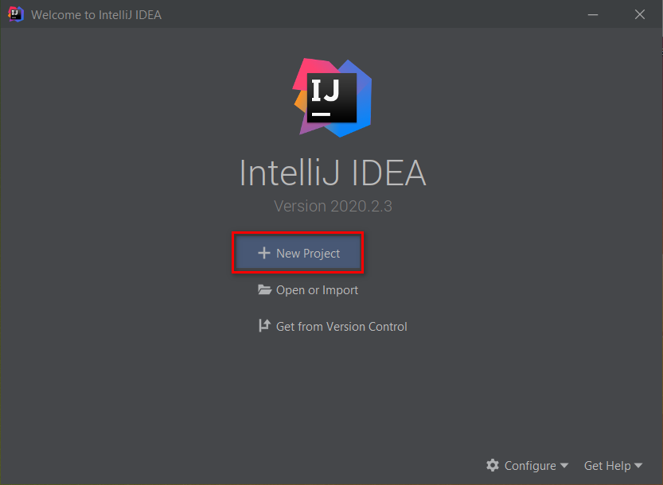

- `New Project` dialog hiện ra, chọn `Java Enterprise`. Trong bài viết này, chúng ta sẽ để mặc định **Build Tool** là `Maven` và **Test Runner** là `JUnit`. Click `Next` để tiếp tục.

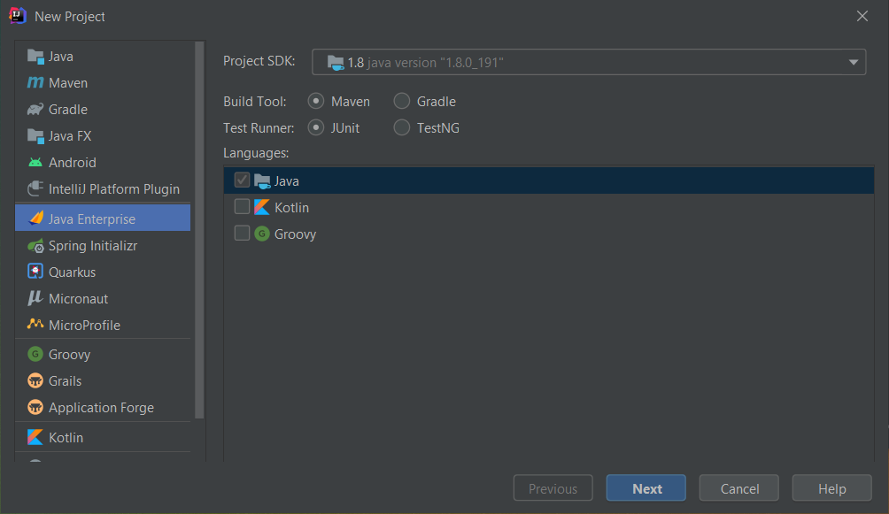

- Add `Servlet` library trong mục `Specifications`, tiếp tục click `Next`.

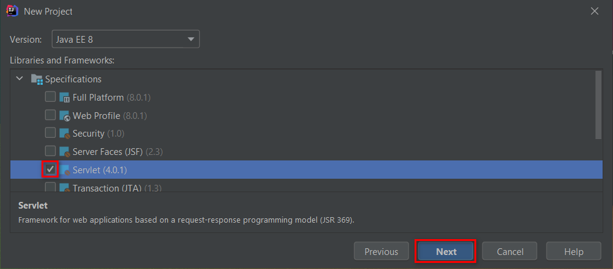

- Đặt tên projcet, nơi lưu, và chọn `Finish`

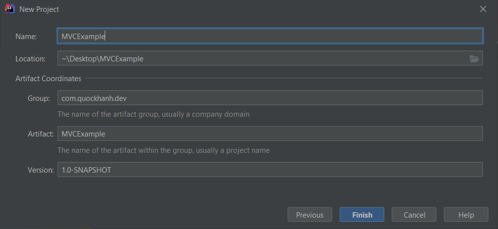

## 2. Viết code theo mô hình MVC

- Cấu trúc project như sau:

<pre>
project
├── src
│   ├── main
│   │   ├── java
│   │   │   ├── com.example.controller
│   │   │   │   └── <a href="./resource/tut-1/src/main/java/com.example.controller/OrderSevlet.java" target="_blank">OrderSevlet.java</a>
│   │   │   ├── com.example.model
│   │   │   │   └── <a href="./resource/tut-1/src/main/java/com.example.model/Order.java" target="_blank">Order.java</a>
│   │   ├── webapp
│   │   │   ├── WEB-INF
│   │   │   │   └─── <a href="./resource/tut-1/src/main/webapp/WEB-INF/web.xml" target="_blank">web.xml</a>
│   │   │   ├── <a href="./resource/tut-1/src/main/webapp/order.jsp" target="_blank">order.jsp</a>
│   │   │   ├── <a href="./resource/tut-1/src/main/webapp/order-error.jsp" target="_blank">order-error.jsp</a>
│   │   │   └── <a href="./resource/tut-1/src/main/webapp/order-success.jsp" target="_blank">order-success.jsp</a>
└── <a href="./resource/tut-1/pom.xml" target="_blank">pom.xml</a>
</pre>

- Project được chia ra ba phần:
  - Phần `Model`gồm các class đặt trong package `com.example.model`
  - Phần `View` gồm các file được lưu ở `src\main\webapp`
  - Phần `Controller` gồm các class đặt trong package `com.example.controller`

## 3. Cấu hình GlassFish Server để run project trên localhost

- Trên thanh menu chọn **`File`** -> **`Setting...`** (hoặc nhấn tổ hợp `Ctrl+Alt+S`), chọn tab **`Build, Execution, Deployment`** -> **`Application Servers`**

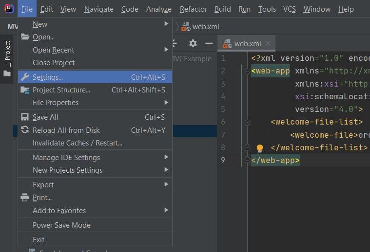

- Nhấn vào biểu tượng dấu **`+`**, chọn **`Glassfish Server`**

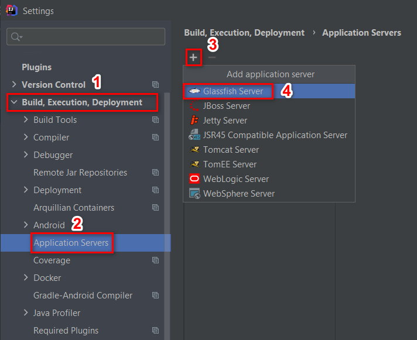

- Chọn đường dẫn đến nơi chứa GlassFish, có thể tải GlassFish 4.1.1 [tại đây][glass-fish-oracle] hoặc [tại đây][glass-fish-reup]

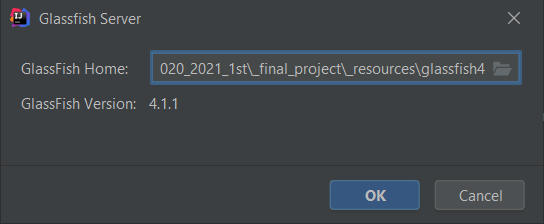

- Cuối cùng chọn **`OK`**

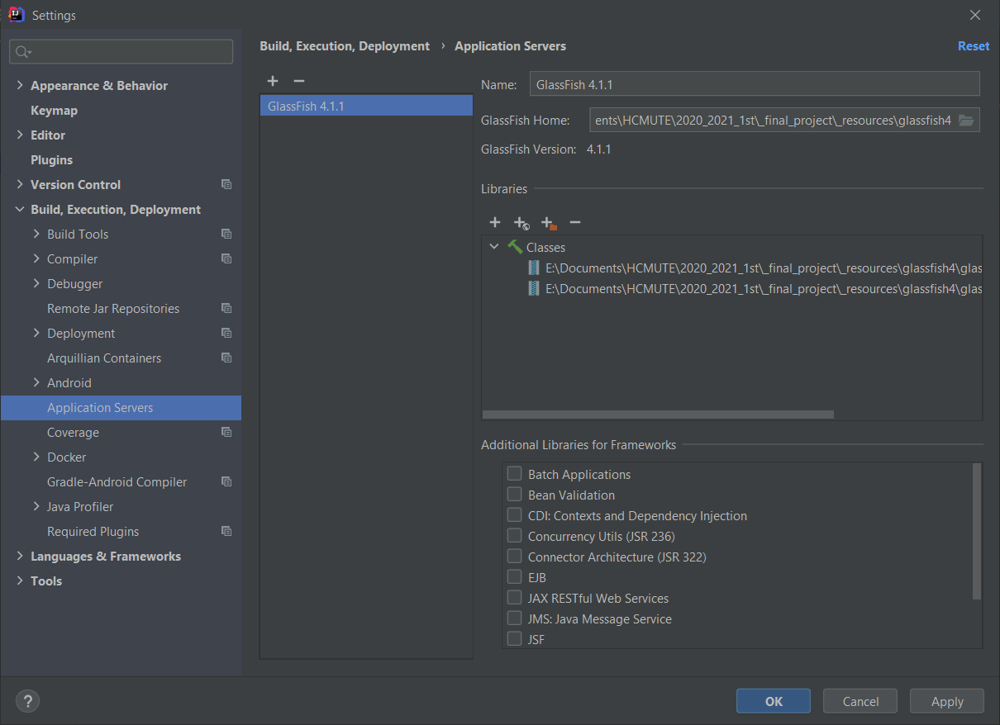

- Edit file `asenv.conf` trong thư mục `glassfish/config`
  - Trên thanh menu chọn **`File`** -> **`Project Structure...`** (hoặc nhấn tổ hợp `Ctrl+Alt+Shift+S`)
  
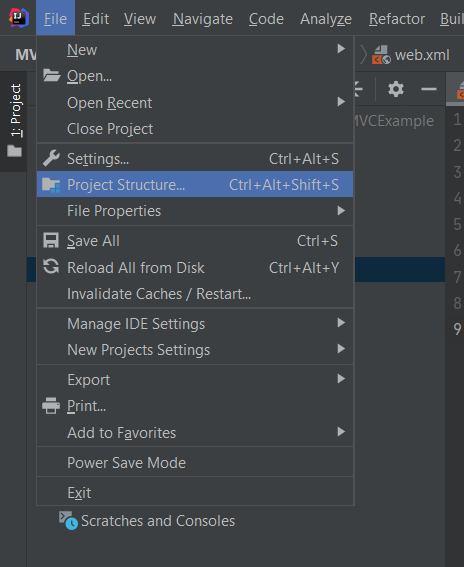 

  
  - **Project Structure** dialog hiện ra, chọn tab **`Platform Settings`** -> **`SDKs`**
  
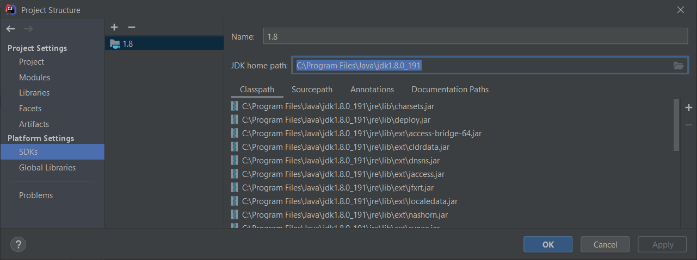

  - Copy `JDK home path` và thêm `AS_JAVA=<JDK home path>` vào cuối file `asenv.conf` như hình dưới đây
  
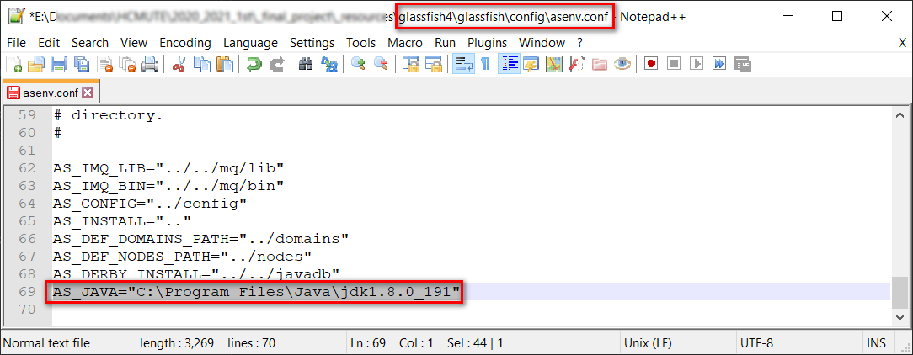

## 4. Tạo GlassFish run configuration

- Vào menu **`Run`** -> **`Edit Configurations...`** 

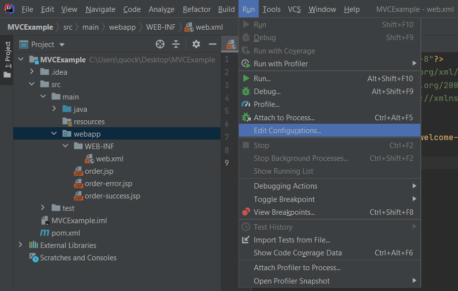

- Nhấn vào biểu tượng dấu **`+`**, chọn **`Glassfish Server Local`**

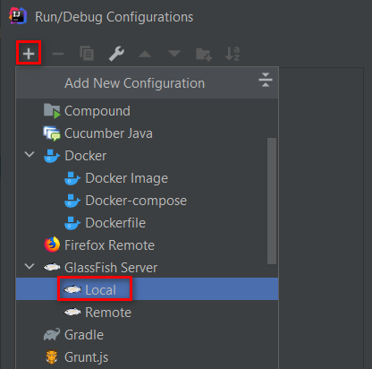

- Tại phần **Glassfish Server Setting** trong tab **`Server`**, đặt giái trị cho **`Server domain`** là `domain1`

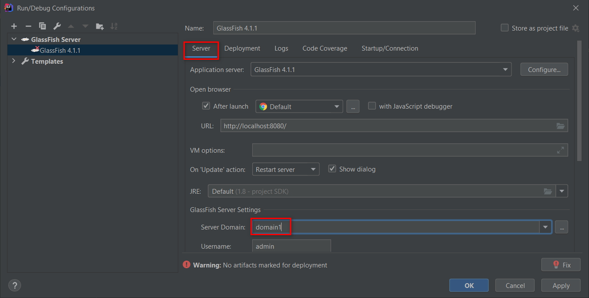

- Trong tab **`Deployment`**, add the `artifact` mà bạn muốn deploy

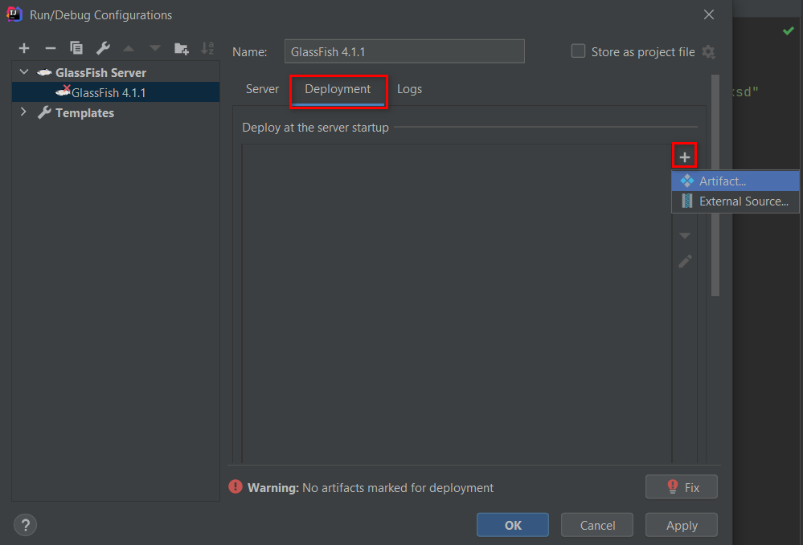

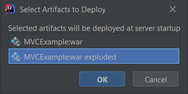

- Mở lại tab **`Server`**, ta thấy `URL` đã được set giá trị là `http://localhost:8080/<project-name>-<version>/`

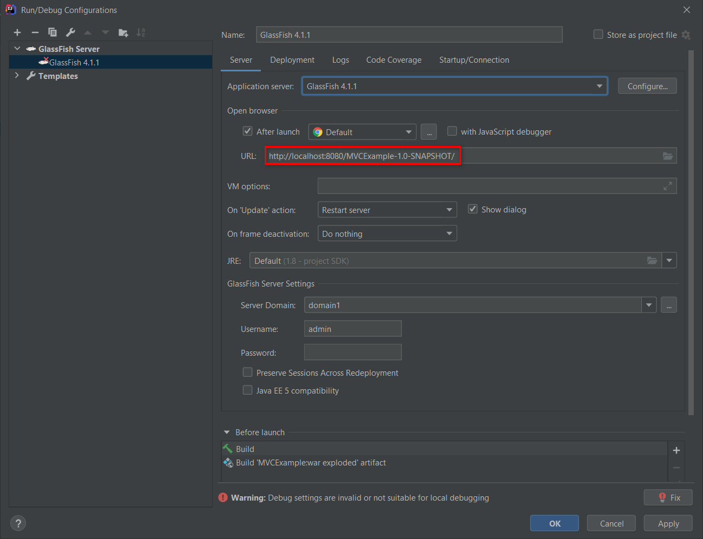

- Click **OK**. Để run configuration, nhấn tổ hợp phím `Alt+Shift+F10` hoặc click vào nút play màu xanh lá góc trên bên trái màn hình

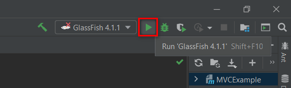

### Khi build project thành công, IDE sẽ mờ trình duyệt, truy cập vào trang web của chúng ta ở localhost

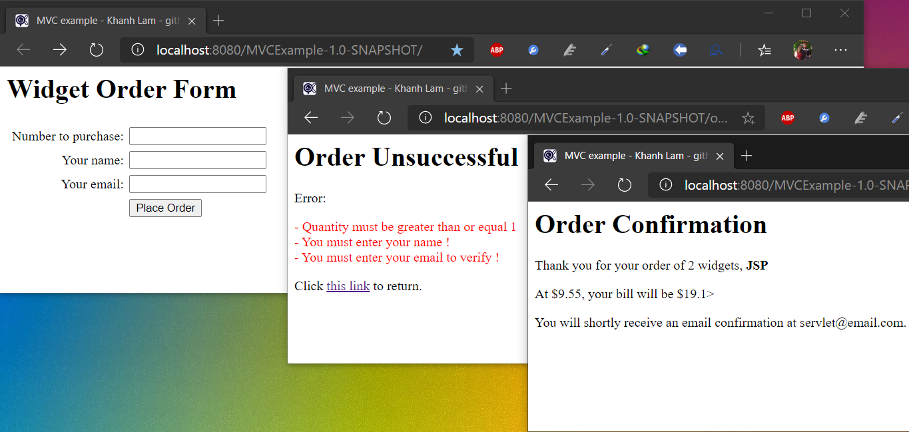

## Thank you for reading <3

[glass-fish-oracle]: https://github.com/quockhanhtn/quockhanhtn/blob/master/img/vietnam_flag.png
[glass-fish-reup]: https://drive.google.com/file/d/1Hj21_zSOEDWbxMiRoZxaLSgqbzLlgipn/view?usp=sharing
