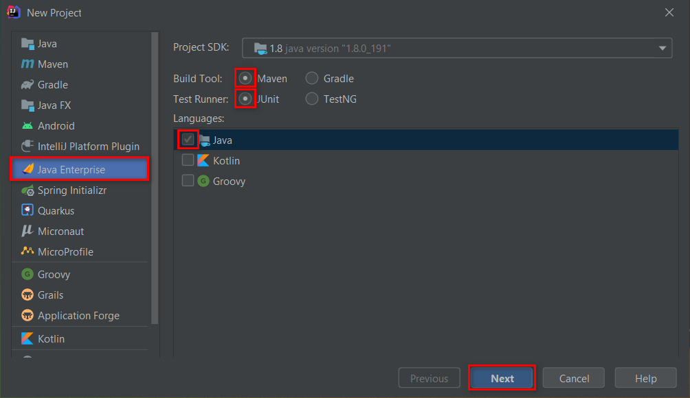

# Tutorial #1 - Example Java EE MVC Web application in IntelliJ IDEA

## 1. Tạo Java Java Enterprise project trong IntelliJ

 

>  
> Chọn `New Project` khi mở IntelliJ

 

> 
> `New Project` dialog hiện ra, chọn `Java Enterprise`. Trong bài viết này, chúng ta sẽ để mặc định **Build Tool** là `Maven` và **Test Runner** là `JUnit`. Click `Next` để tiếp tục.

 

- Add `Servlet` library trong mục `Specifications`, tiếp tục click `Next`.

- Đặt tên projcet, nơi lưu, và chọn `Finish`

## 2. Viết code theo mô hình MVC

- Cấu trúc project như sau:

<pre>
project
├── src
│   ├── main
│   │   ├── java
│   │   │   ├── com.example.controller
│   │   │   │   └── <a href="./resource/tut-1/src/main/java/com.example.controller/OrderSevlet.java" target="_blank">OrderSevlet.java</a>
│   │   │   ├── com.example.model
│   │   │   │   └── <a href="./resource/tut-1/src/main/java/com.example.model/Order.java" target="_blank">Order.java</a>
│   │   ├── webapp
│   │   │   ├── WEB-INF
│   │   │   │   └─── <a href="./resource/tut-1/src/main/webapp/WEB-INF/web.xml" target="_blank">web.xml</a>
│   │   │   ├── <a href="./resource/tut-1/src/main/webapp/order.jsp" target="_blank">order.jsp</a>
│   │   │   ├── <a href="./resource/tut-1/src/main/webapp/order-error.jsp" target="_blank">order-error.jsp</a>
│   │   │   └── <a href="./resource/tut-1/src/main/webapp/order-success.jsp" target="_blank">order-success.jsp</a>
└── <a href="./resource/tut-1/pom.xml" target="_blank">pom.xml</a>
</pre>

- `View` của project sẽ đề trong `src\main\webapp`
