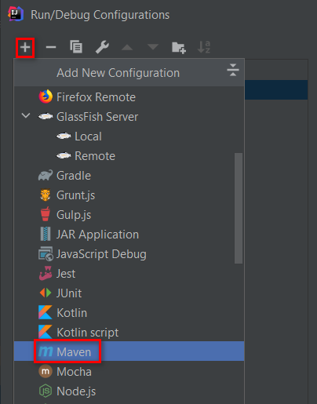
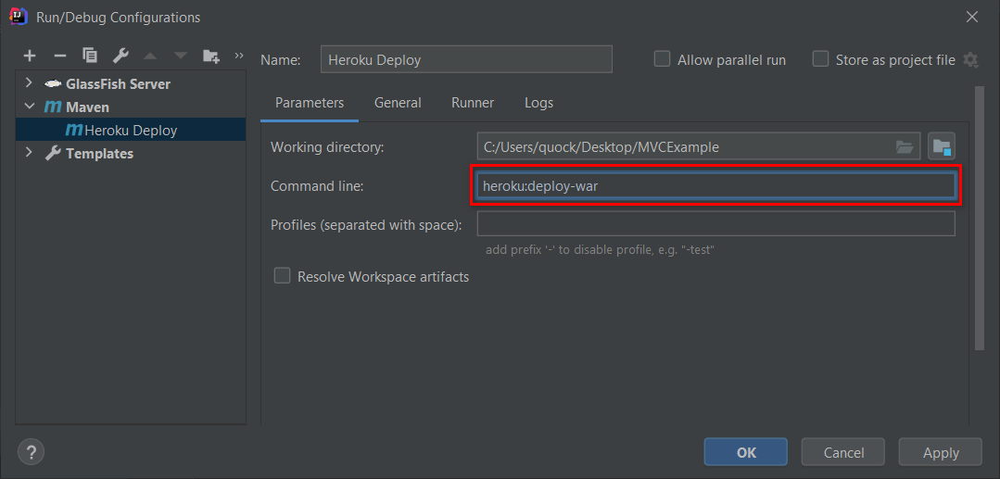
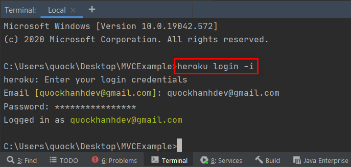
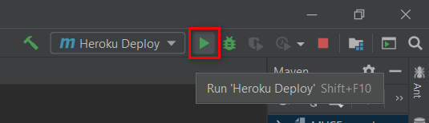
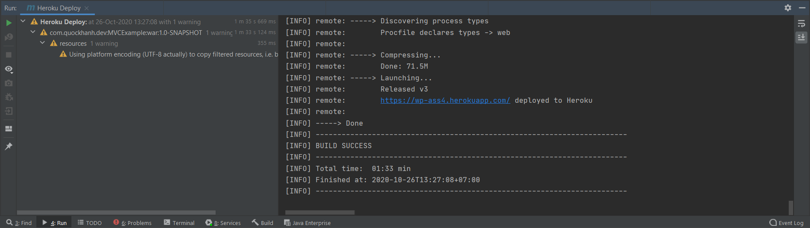
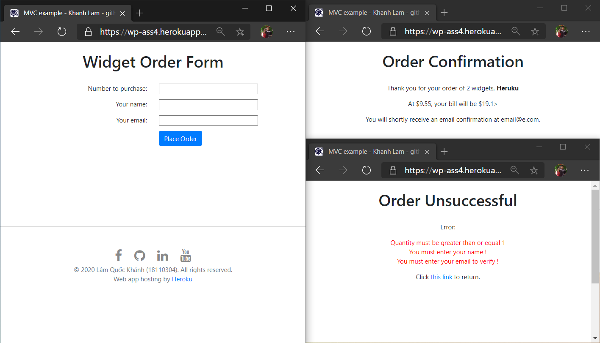

# Tutorial #2 - Deploying Java Applications to Heroku from IntelliJ IDEA

## 1. Tùy chỉnh file pom.xml
> Thêm đoạn code sau vào file **`pom.xml`**, nhớ đổi appName lại thành tên app trên Heroku của bạn nhé !
```xml
<?xml version="1.0" encoding="UTF-8"?>
<project ... >
    ...

    <build>
        <plugins>
           ...
           <!--Add code from begin to end-->
           <!--begin-->
            <plugin>
                <groupId>com.heroku.sdk</groupId>
                <artifactId>heroku-maven-plugin</artifactId>
                <version>3.0.3</version>
                <configuration>
                    <appName>wp-ass4</appName>
                </configuration>
            </plugin>
            <!--end-->

        </plugins>
    </build>
</project>
```

## 2. Tạo Heroku deploy configuration

- Vào menu **`Run`** -> **`Edit Configurations...`** 
<p align="center"></p>

- Nhấn vào biểu tượng dấu **`+`**, chọn **`Maven`**
<p align="center"></p>

- Tại tab **`Parameters`**, đặt giá trị cho `Comand line` là **`heroku:deploy-war`**
<p align="center"></p>

## 3. Đăng nhập tài khoản Heruko

- Trước khi deploy, chúng ta cần mở **`Command line`** và đăng nhập tài khoản Heroku để xác thực quyền của trên app

- Dùng lệnh **`heroku login -i`** để có thể đăng nhập tài khoản mà không cần mở trình duyệt, sau đó nhập email và mật khẩu.
<p align="center"></p>

## 4. Bắt đầu deploy thôi 😎

- Nhấn tổ hợp phím `Alt+Shift+F10` hoặc click vào nút play màu xanh lá góc trên bên trái màn hình. Nhớ set configuration là configuration vừa tạo nhé !
<p align="center"></p>

- Lần đầu do phải download các package về nên hơi lâu xíu ! Khi xuất hiện `BUILD SUCCESS` trong **`Run dialog`** thì đã deloy thành công 😎
<p align="center"></p>

## 5. Mở web app và kiểm tra kết quả thôi 
<p align="center"></p>

## 6. Update web app
Mỗi khi chỉnh sửa project, chúng ta chỉ cần chọn `configuration` là `Heroku deploy` và run lại thôi thì web app sẽ được deploy lại lên host.

## Thank you for reading <3